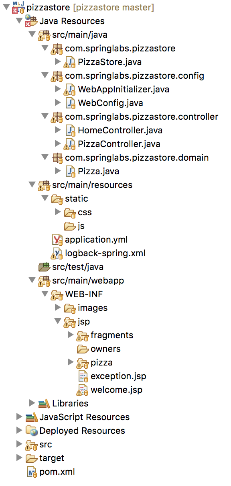
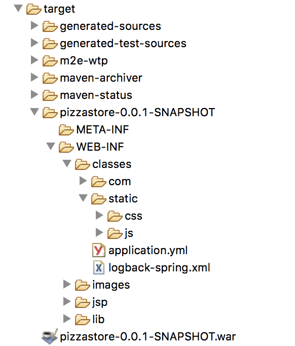
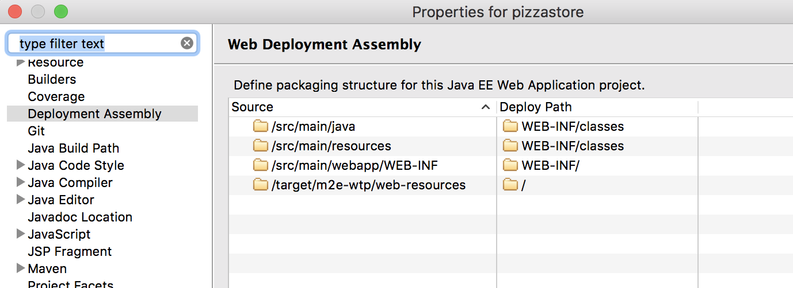
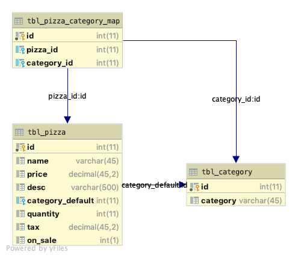
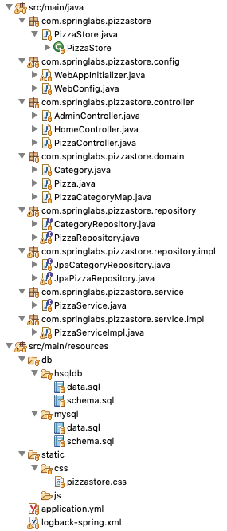

# SpringLabs

The following is a developers journey as well as a demonstration of what's possible with Spring.

### How is it different from PetClinic ?

This is similar to PetClinic in some ways but it is going to be a lot more.

What is PetClinic for those who haven't heard about PetClinic? 

The Spring PetClinic is a sample application designed to show how the Spring stack can be used to build simple, but powerful database-oriented applications.

Have a look here: https://spring-petclinic.github.io/

### What is SpringLabs about?

SpringLabs will encompass a lot more and one of them is developing a Spring application based on a fictional usecase. This will sound a lot similar to PetClinic but 

- we will be covering the whole process and software development cycle like a real-time project. We will have phases and each phase will have multiple sprints.  
- expanding more on the usecases and integrations 
- journal the development process - essentially the challenges and observations to benefit other developers

We will start with a **simple pizza store usecase** for demonstration.

This will stand out as a reference implementation using the latest spring stack and also as a tutorial for anyone who wants to learn Spring.


# PizzaStore Project

We will develop a pizza store web application in multiple phases. Each phase will be spread out in multiple sprints.

The use case is simple.

> A fictional customer needs a online e-commerce store for his pizza outlet.

## Phase 1 deliverables

Let's define the usecase presented by our fictional customer for the phase 1 of implementation.

**Roles**:

The below list are the roles defined within the system.

- Store Admin -> can create new pizza and publish on store

- Customers (guest) -> can view pizzas

- Customers (registered) -> can order pizza

There is no concept of a checkout and payment (to keep the usecase simple)

**Screens**:

1. Welcome screen, 
2. Register screen,
3. Login screen, 
4. Pizza list screen, 
5. Pizza (pdp) screen, 
6. Home screen (only available to registered users to show past orders)
7. Admin screen (to add and delete pizza), 
8. Orders screen (to view the orders)

**Flow**:

- A Guest can view pizzas and only registered users can order a pizza.
- Pizza's marked as ordered by a customer will be shown to the customer's home screen and also to the admin.
- Admin can add, edit and delete pizzas.
- Admin can mark an added pizza ready to published
- Only pizzas marked as published appear on store


## Primary technology stack and build tools

I'm using Spring version 5. 

There are 4 choices  

- Xxx- spring-boot-maven: for a maven spring boot configuration
- Xxx- spring-bom-maven: for a standard spring maven configuration running on server's like wildfly.
- Xxx- spring-boot-gradle: for a gradle spring boot configuration
- Xxx- spring-bom-gradle: for a standard spring gradle configuration running on server's like wildfly.

 

We will start by using **spring boot maven**.


## Sprint 1: Basics

### Objectives:

Let's first create a basic structre with 2 controllers and few pages and one Pizza Bean.

Controllers:

1. Home Controller 
   - /welcome --  for welcome screen 

2. Pizza Controller for pizza listing
   - /pizza/all 			-- for pizza listing
   - /pizza/{pizzaId}  -- for a single pizza
   - /pizza/save         -- for saving a new/existing pizza
3. Admin Controller

Pages:

1. Welcome
2. Pizza Listing
3. Pizza
4. Error

Repository:

1. Pizza Repository -- for all DAO calls related to pizza

### Stack

- Spring Boot : version 2.2.0.BUILD-SNAPSHOT
- Logging: logback (default that comes with spring)
- Server:  Spring Boot default (tomcat 9.x)
- Java: 11
- Templating: JSP
- JPA: Spring Data JPA
- Caching: Not in scope for now
- Tests: Not in scope for now
- Database: MySQL and HSQL (for first release alone)

### Creating project structure





Few things to note:

1. I'm using spring boot maven configuration
2. Be aware that Spring boot 2.2.0 loads Spring web 5.2.0, logback 1.2.3, tomcat 9 among other things.
3. application.yml is left empty to load the default configurations. 
   So the context path is "" and port is 8080.
4. logback-spring.xml is configured to print more logs. (Debug level)
5. You will notice that WebAppInitializer is left commented because I have gone with the defaults and since it's spring boot, if you are going with defaults then it's already configured by boot. 
6. WebAppInitializer code will be needed when we go for non-boot approach.
7. The code and the comments itself are self-explanatory.

### Source code:

We started with branch [basic-spring-boot-maven](https://github.com/john77eipe/SpringLabs/blob/basic-spring-boot-maven) and then we advanced into [crud-jpa-spring-boot-maven](https://github.com/john77eipe/SpringLabs/tree/crud-jpa-spring-boot-maven) branch.

### Challenges:

There were quite a few challenges when starting with this.

1. Getting the POM file correct.
   - Easiest way is to download from spring initialiser (<https://start.spring.io/>)
   - There was a strange unknown error in pom. Solved it by added `packaging` element.
   - Make sure you specify the boot version at a global location. I did it using the parent artefact configuration.
   - Make sure junit 4 is not loaded (because we will be using junit 5 in future). Add proper excludes to your `spring-boot-starter-test`
   - You definitely don't want to stop and start the server everytime you make changes to static files. For this add `spring-boot-devtools` to your dependencies.
   - Though I have JDK 11 we can decide to compile it against 1.8 using the maven configuration

2. Getting your first view and controller working.
   - Make sure you use the correct annotations.

   - You need to create a ViewResolver so that spring knows were your jsp pages are.

   - Note that I used `src/main/webapp/WEB-INF ` to store jsp's and images and `src/main/resources` for css and javascript. This is only a personal preference. J2EE applications originally had a WebContent folder but the mvn

     <https://stackoverflow.com/questions/18412866/difference-webcontent-and-webapp>
   - The `src/main/webapp/` might not show up in the Project explorer view. For that you need to mark it as a source folder in eclipse.
     

3. Getting your static content loading
   - Note few things: 
     - all files under  `src/main/resources` will be compiled in the top level class path, basically `target/WEB-INF/classes`

     - all files under `src/main/webapp` will be placed under the `target/WEB-INF` level.

     - analyze this by viewing your generated target folder and the deployment assembly setting.

     - 

     - 

     - Links for more clarity

       Resource files: <https://stackoverflow.com/questions/46183633/spring-boot-use-resources-templates-folder-with-jsp-templates-instead-of-webapp>

       Spring boot defaults: <https://docs.spring.io/spring-boot/docs/current/reference/html/boot-features-developing-web-applications.html>

   - JSP still doesn't compile and show on screen

     The tomcat default that comes with spring boot doesn't have all the jars. One thing that is missing is `tomcat-embed-jasper` that provides the support for jsp rendering. Read more about it here:<https://dzone.com/articles/spring-boot-embedded-tomcat-example>
     

4. There might be multiple ways to solve the same thing. This is both a good and bad thing with Spring as it gets confusing. 

   A thing to note is we may end up having more than one configuration for the same property.

   Here’s the **priority order in descending order,** which Spring Boot uses to select the effective configuration:

   1. Java Config
   2. Command Line Arguments
   3. Java System Properties
   4. OS Environment Variables
   5. *application.properties* in Current Directory
   6. *application.properties* in the classpath (*src/main/resources* or the packaged jar file)

   <https://www.baeldung.com/spring-boot-context-path>

5. Confusion between Spring Data JPA, JPA, Hibernate and EclipseLink

   JPA is a specification that defines an API for object-relational mappings and for managing persistent objects. Hibernate and EclipseLink are 2 popular implementations of this specification. 

   Spring Data JPA adds a layer on top of JPA. That means it uses all features defined by the JPA specification, especially the entity and association mappings, the entity lifecycle management, and [JPA’s query capabilities.](https://thoughts-on-java.org/jpql/) On top of that, Spring Data JPA adds its own features like a no-code implementation of the [repository pattern](https://thoughts-on-java.org/implementing-the-repository-pattern-with-jpa-and-hibernate/) and the creation of database queries from method names.

   Spring Data JPA is basically Spring Data *for* JPA, just like Spring Data MongoDB is Spring Data *for* MongoDB, just like Spring Batch is Spring *for* batch applications, Spring Integration is Spring *for* integration projects.

   Do correct your dependency graph for JPA:

   ```bash
   Application -> Spring Data JPA -> JPA <- Hibernate -> JDBC -> DataSource
   
   -> — uses
   <- — implements
   ```

   The above is from this [excellant stack overflow answer.](https://stackoverflow.com/questions/36920843/is-spring-data-jpa-a-jpa-implementation?rq=1)

   For now, we use Spring Data JPA because it's easy for quick starts and gives us quite a good deal of helper methods. Another answer [discussion here on choosing SpringDataJPA  vs Direct Hibernate JPA](https://stackoverflow.com/questions/12790853/how-does-spring-data-jpa-differ-from-hibernate-for-large-projects).

   

6. Choosing the correct Spring Data JPA Repository

   There are 3 repository interfaces that you should know when you use Spring Data JPA:

   - [*CrudRepository*](https://docs.spring.io/spring-data/commons/docs/current/api/org/springframework/data/repository/CrudRepository.html)
   - [*PagingAndSortingRepository*](https://docs.spring.io/spring-data/commons/docs/current/api/org/springframework/data/repository/PagingAndSortingRepository.html)
   - [*JpaRepository*](https://docs.spring.io/spring-data/jpa/docs/current/api/org/springframework/data/jpa/repository/JpaRepository.html)

   As you might guess from its name, the *CrudRepository* interface defines a repository that offers standard create, read, update and delete operations. The *PagingAndSortingRepository* extends the *CrudRepository* and adds *findAll* methods that enable you to sort the result and to retrieve it in a paginated way. Both interface are also supported by other Spring Data projects, so that you can apply the same concepts to different datastores. The *JpaRepository* adds JPA-specific methods, like *flush()* to trigger a flush on the persistence context or *findAll(Example example)* to find entities by example, to the *PagingAndSortingRepository.* 
   
7. Getting your logging straight.

   1. Why slf4j ?

      Simple Logging Facade for Java (abbreviated SLF4J) – acts as a [facade](https://en.wikipedia.org/wiki/Facade_pattern) for different logging frameworks (e.g. [java.util.logging, logback, Log4j](https://www.baeldung.com/java-logging-intro)). It offers a generic API making the logging independent of the actual implementation.

      This allows for different logging frameworks to coexist. It also helps migrate from one framework to another. Finally, apart from standardized API, it also offers some “syntactic sugar”.

      More about slf4j: https://stackify.com/slf4j-java/

   2. What is in the current project?

      Spring boot provides a default starter for logging - `spring-boot-starter-logging`. It is included by default in `spring-boot-starter` which is included in all other starters.

      If you check the mvn dependency tree of the project, you will see

      ```bash
      +- org.springframework.boot:spring-boot-starter-web:jar:2.2.0.BUILD-SNAPSHOT:compile
      [INFO] |  +- org.springframework.boot:spring-boot-starter:jar:2.2.0.BUILD-SNAPSHOT:compile
      [INFO] |  |  +- org.springframework.boot:spring-boot-starter-logging:jar:2.2.0.BUILD-SNAPSHOT:compile
      [INFO] |  |  |  +- ch.qos.logback:logback-classic:jar:1.2.3:compile
      [INFO] |  |  |  |  \- ch.qos.logback:logback-core:jar:1.2.3:compile
      [INFO] |  |  |  +- org.apache.logging.log4j:log4j-to-slf4j:jar:2.12.1:compile
      [INFO] |  |  |  |  \- org.apache.logging.log4j:log4j-api:jar:2.12.1:compile
      [INFO] |  |  |  \- org.slf4j:jul-to-slf4j:jar:1.7.28:compile
      ```

      Spring uses logback as an implementation by default and also adds bridges for JUL (Java.util.logging) and log4j incase any other dependencies need it.

      We will continue to use the default logback and slf4j api.

8. Debugging the application

   Since it's a spring boot project we have 2 options

   - use remote debugging on your eclipse but before that enable it on the application while starting it  `mvn spring-boot:run -Dspring-boot.run.jvmArguments="-Xdebug -Xrunjdwp:transport=dt_socket,server=y,suspend=y,address=5005"`
   - since it's a main program, right click on that file and use debug-as option in eclipse

9. Primary Key Autogeneration

   `@GeneratedValue(strategy = GenerationType.AUTO)` didn't work and had to use ` GenerationType.IDENTITY`. (maybe AUTO will work with MySQL)

### Maven and Spring Configuration Files

```xml
<?xml version="1.0" encoding="UTF-8"?>
<project xmlns="http://maven.apache.org/POM/4.0.0" xmlns:xsi="http://www.w3.org/2001/XMLSchema-instance"
	xsi:schemaLocation="http://maven.apache.org/POM/4.0.0 http://maven.apache.org/xsd/maven-4.0.0.xsd">
	<modelVersion>4.0.0</modelVersion>
	<parent>
		<groupId>org.springframework.boot</groupId>
		<artifactId>spring-boot-starter-parent</artifactId>
		<version>2.2.0.BUILD-SNAPSHOT</version>
		<relativePath/> <!-- lookup parent from repository -->
	</parent>
	<groupId>com.springlabs</groupId>
	<artifactId>pizzastore</artifactId>
	<version>0.0.1-SNAPSHOT</version>
	<name>pizzastore</name>
	<description>Demo project for Spring Boot</description>
	<packaging>war</packaging>
	
	<properties>
		<java.version>1.8</java.version>
	</properties>

	<dependencies>
	
		<!-- Spring Boot and Web -->
		<dependency>
			<groupId>org.springframework.boot</groupId>
			<artifactId>spring-boot-starter-web</artifactId>
		</dependency>
		
		<!-- Spring Boot and Data JPA -->
    <dependency>
      <groupId>org.springframework.boot</groupId>
      <artifactId>spring-boot-starter-data-jpa</artifactId>
    </dependency>

    <dependency>
      <groupId>org.hsqldb</groupId>
      <artifactId>hsqldb</artifactId>
      <scope>runtime</scope>
    </dependency>

		<!-- Jstl -->
    <dependency>
      <groupId>javax.servlet</groupId>
      <artifactId>jstl</artifactId>
    </dependency>
        
    <!-- For JSP compilation -->
    <!-- As of the current version of Spring Boot the reference guide (http://docs.spring.io/spring-boot/docs/1.3.3.RELEASE/reference/htmlsingle/) states:
JSPs should be avoided if possible, there are several known limitations when using them with embedded servlet containers.
The reference guide then goes on to provide a list of JSP limitations in chapter 27.3.5. Specifically, it states that:
An executable jar will not work because of a hard coded file pattern in Tomcat.
		-->
		<dependency>
			<groupId>org.apache.tomcat.embed</groupId>
			<artifactId>tomcat-embed-jasper</artifactId>
			<scope>provided</scope>
		</dependency>
        
        <!-- For Junit and Integration Tests -->
		<dependency>
			<groupId>org.springframework.boot</groupId>
			<artifactId>spring-boot-starter-test</artifactId>
			<scope>test</scope>
			<exclusions>
				<exclusion>
					<groupId>org.junit.vintage</groupId>
					<artifactId>junit-vintage-engine</artifactId>
				</exclusion>
				<exclusion>
					<groupId>junit</groupId>
					<artifactId>junit</artifactId>
				</exclusion>
			</exclusions>
		</dependency>

		<!-- Dev tools for hot swapping -->
	    <dependency>
	        <groupId>org.springframework.boot</groupId>
	        <artifactId>spring-boot-devtools</artifactId>
	        <optional>true</optional>
	    </dependency>

		
	</dependencies>
	
	

	<build>
		<plugins>
			<plugin>
				<groupId>org.springframework.boot</groupId>
				<artifactId>spring-boot-maven-plugin</artifactId>
			</plugin>
		</plugins>
	</build>

	<repositories>
		<repository>
			<id>spring-snapshots</id>
			<name>Spring Snapshots</name>
			<url>https://repo.spring.io/snapshot</url>
			<snapshots>
				<enabled>true</enabled>
			</snapshots>
		</repository>
		<repository>
			<id>spring-milestones</id>
			<name>Spring Milestones</name>
			<url>https://repo.spring.io/milestone</url>
		</repository>
	</repositories>
	<pluginRepositories>
		<pluginRepository>
			<id>spring-snapshots</id>
			<name>Spring Snapshots</name>
			<url>https://repo.spring.io/snapshot</url>
			<snapshots>
				<enabled>true</enabled>
			</snapshots>
		</pluginRepository>
		<pluginRepository>
			<id>spring-milestones</id>
			<name>Spring Milestones</name>
			<url>https://repo.spring.io/milestone</url>
		</pluginRepository>
	</pluginRepositories>

</project>
```

```yaml
# database init, supports mysql too
database: hsqldb
spring:
    datasource:
        data: classpath*:db/${database}/data.sql
        schema: classpath*:db/${database}/schema.sql
    jpa:
        hibernate:
            ddl-auto: none

```


Few things to note:

1. As discussed in challenges, we have the imporant dependencies configured correctly
2. HSQL runtime dependency is added - for now we are using only HSQL db as an in-memory database
3. We do not configure datasource anywhere - spring boot magic and defaults to the only available runtime jdbc jar (hsqldb)
4. `spring-boot-devtools` helps during development for hot swapping (no need to restart the server for java and static file changes)
5. We create and load the schema and data
6. We have a simple logger configuration in `logback-spring.xml` 


## Sprint 2: MySQL and Schema Refactoring

### Objectives:

1. Refactor table names to `tbl_` format

2. Add addtional attributes to domain Pizza

3. Switch to MySQL (relavent changes to pom and yml files)

4. Use HSQL only for Junit tests

5. Add secondary categories through a mapping table

6. Add respective services to fetch secondary categories and display secondary categories on Pizza page

7. Expected:

   


### Source code: 

Commited on branch: [schema-refined-spring-boot-maven](https://github.com/john77eipe/SpringLabs/tree/schema-refined-spring-boot-maven)




### Challenges:

- Getting the custom query for secondary categories working
  - JPQL sucked for writing joins - it was non-intutive and hardly had any proper documentation and thus I chose native queries
  - Getting the native query to work took some time

```sql
SELECT * FROM tbl_category C INNER JOIN tbl_pizza_category_map PCM ON PCM.category_id = C.id where PCM.pizza_id=:pizzaId
```

Resulted in

```shell
org.hibernate.loader.custom.NonUniqueDiscoveredSqlAliasException: Encountered a duplicated sql alias [id] during auto-discovery of a native-sql query
```

But then,

```sql
SELECT C.id, C.category FROM tbl_category C INNER JOIN tbl_pizza_category_map PCM ON PCM.category_id = C.id where PCM.pizza_id=:pizzaId
```

Resulted in 

```shell
org.springframework.core.convert.ConverterNotFoundException: No converter found capable of converting from type [java.lang.Integer] to type [com.springlabs.pizzastore.domain.Category]
```

Finally this worked,

```sql
SELECT C.id as id, C.category as category FROM tbl_category C INNER JOIN tbl_pizza_category_map PCM ON PCM.category_id = C.id where PCM.pizza_id=:pizzaId"
```

- To see the generated SQL query with the substituted parameters by hibernate enable the log `org.hibernate.type` to TRACE 

- Auto generation schema and data load failed for MySQL.  Database init doesn't work

  If you're using **Spring boot 2**, database initialization only works for embedded databases (H2, HSQLDB, ...). If you want to use it for other databases as well, you need to change the `spring.datasource.initialization-mode` property:

  ```properties
  spring.datasource.initialization-mode=always
  ```

- Should we change the ` @GeneratedValue` annotation? 

  - No need. 

  - Know that the JPA specification allows you to define the strategy you want to use to create unique primary key values. You can choose between *SEQUENCE*, *IDENTITY*, TABLE, and *AUTO*.

    In general, it is recommended to use the *SEQUENCE* strategy because it allows Hibernate to use JDBC batching and other optimization strategies that require the delayed execution of SQL INSERT statements.

  - But you can’t use this strategy with a MySQL database. It requires a database sequence, and MySQL doesn’t support this feature.

    So, you need to choose between *IDENTITY* and *TABLE*. That’s an easy decision considering the performance and scalability issues of the *TABLE* strategy*.*

  - If you’re working with a MySQL database, you should always use `GenerationType.IDENTITY`. It uses an autoincremented database column and is the most efficient approach available.

  - When you use the GenerationType.AUTO, Hibernate selects the generation strategy based on the Hibernate dialect. That’s a common approach if you need to support multiple databases.

  - Problems that you might face when using AUTO in Hibernate 5 is listed here: https://thoughts-on-java.org/5-things-you-need-to-know-when-using-hibernate-with-mysql/

- Now and then I got `SQL Exception` - wrong syntax exception for JPA generated queries

  This took some time to figure out as I was hardly writing any queries and this error occured for almost all JPA queries.

  ```markdown
  com.mysql.jdbc.exceptions.jdbc4.MySQLSyntaxErrorException: You have an error in your SQL syntax; check the manual that corresponds to your MySQL server version for the right syntax to use near 'desc, name) values
     
  ```

  The problem is in the generated query, due to the usage of `desc` since it's a reserved word in MySQL.

  Possible solutions:

  1. Change the name of your column to `description`. Do similar with `name`.

  2. Change the configuration in MySQL to support these kind of names for columns in queries.

  3. Change the name of the column in the fields to append ` character (referenced from [Creating field with reserved word name with JPA](https://stackoverflow.com/q/2224503/1065197)):

     ```
     @Column(name="`desc`")
     ```

  IMO while option 3 is a quick and dirty solution, I find option 1 as the best solution for future usage of the database.

  Thanks to this https://stackoverflow.com/questions/28946567/sql-error-1064-sqlstate-42000-while-creating-new-entity

- If you are using Java 9, 10 or 11, then you will encounter an error when you run your Hibernate program.

  ```shell
  Error: Exception in thread "main" java.lang.NoClassDefFoundError: javax/xml/bind/JAXBException
  ```

  This happens because of Java 9 and higher. 

  Java 9 and higher has removed java.xml.bind from its default classpath. That's why we get the class not found exception.  We have to explicitly add JAR files to the build path.

  You need to add the following JAR files:

  javax.activation-1.2.0.jar
  jaxb-api-2.3.0.jar
  jaxb-core-2.3.0.jar
  jaxb-impl-2.3.0.jar

  Since we are using maven it took care of this. :-)

- Re-using the same domain model (entity beans) for front-end. 

  This approach eases the code and the need to have a seperate view object (DTO) for now.
  While using a non-managed attribute `secondaryCategories`in Pizza Bean it should be annotated with `@Transient` to notify that this is not a JPA managed attribute.

  Note: The `transient` keyword and `@Transient` annotation have two different purposes: one deals with **serialization** and one deals with **persistence**. As programmers, we often marry these two concepts into one, but this is not accurate in general. [Persistence](https://en.wikipedia.org/wiki/Persistence_(computer_science)) refers to the characteristic of state that outlives the process that created it. [Serialization](https://docs.oracle.com/javase/tutorial/jndi/objects/serial.html) in Java refers to the process of encoding/decoding an object's state as a byte stream.

  **The `transient` keyword is a stronger condition than `@Transient`:**

  If a field uses the `transient` keyword, that field will not be serialized when the object is converted to a byte stream. Furthermore, since JPA treats fields marked with the `transient` keyword as having the `@Transient` annotation, the field will not be persisted by JPA either.

  On the other hand, fields annotated `@Transient` alone **will** be converted to a byte stream when the object is serialized, but it will not be persisted by JPA. Therefore, the `transient` keyword is a stronger condition than the `@Transient` annotation. Thanks to this [stackoverflow answer](https://stackoverflow.com/questions/2154622/why-does-jpa-have-a-transient-annotation)

```java
@SqlResultSetMapping(
        name="CategoriesThatAdminLikesResult",
        entities={
                @EntityResult(
                        entityClass = com.springlabs.pizzastore.domain.Category.class,
                        fields={@FieldResult(name="id",column="id"),
                                 @FieldResult(name="category", column="category")}
                )
        }
)
@NamedNativeQuery(
        name="CategoriesThatAdminLikes",
        query="SELECT id, category FROM tbl_category",
        resultSetMapping = "CategoriesThatAdminLikesResult"
)
```


## Sprint 3: Fine tuning existing features and testing

### Objectives:

- Check and fine tune error handling approaches
- Add JUnit 
- Switch to Log4j 2.x from the default Logback because Log4j 2.x is awesome and most of the open source projects utilize log4j.
- Utilize Java 8 optimisations 
- Jsp to Thymeleaf

### Source code:

Commited on branch: [fine-tuning-spring-boot-maven](https://github.com/john77eipe/SpringLabs/tree/fine-tuning-spring-boot-maven)

### Challenges:

- JSP to Thymeleaf

  This was a pain; had to google for every syntax. After using it for some time was getting a hang of it.

  Remember to remove all unwanted libraries from POM.
  
- JUnit tests for service and controller layers

  I only place few samples. Note that we are using HSQL db for testing but eventually we want to move from there and use something very close (another mysql test db) for testing. 

- Adding Log4j2

  - Changes to pom

  Spring boot provides a default starter for logging - `spring-boot-starter-logging`. It is included by default in `spring-boot-starter` which is included in all other starters.

  What's present in the default starter logging is 

  ```xml
  <dependency>
    <groupId>ch.qos.logback</groupId>
    <artifactId>logback-classic</artifactId>
    <scope>compile</scope>
  </dependency>
  <dependency>
    <groupId>org.apache.logging.log4j</groupId>
    <artifactId>log4j-to-slf4j</artifactId>
    <scope>compile</scope>
  </dependency>
  <dependency>
    <groupId>org.slf4j</groupId>
    <artifactId>jul-to-slf4j</artifactId>
    <scope>compile</scope>
  </dependency>
  <dependency>
    <groupId>org.slf4j</groupId>
    <artifactId>log4j-over-slf4j</artifactId>
    <scope>compile</scope>
  </dependency>
  ```

  We would need to exclude the dependency on `spring-boot-starter-logging` and add a dependency on `spring-boot-starter-log4j2`.

  ```xml
  <dependency>
      <groupId>org.springframework.boot</groupId>
      <artifactId>spring-boot-starter</artifactId>
      <exclusions>
          <exclusion>
              <groupId>org.springframework.boot</groupId>
              <artifactId>spring-boot-starter-logging</artifactId>
          </exclusion>
      </exclusions>
  </dependency>
  <dependency>
      <groupId>org.springframework.boot</groupId>
      <artifactId>spring-boot-starter-log4j2</artifactId>
  </dependency>
  ```

  This essentially changes the logging implementation to

  ```xml
  <dependency>
    <groupId>org.apache.logging.log4j</groupId>
    <artifactId>log4j-slf4j-impl</artifactId>
    <scope>compile</scope>
  </dependency>
  <dependency>
    <groupId>org.apache.logging.log4j</groupId>
    <artifactId>log4j-api</artifactId>
    <scope>compile</scope>
  </dependency>
  <dependency>
    <groupId>org.apache.logging.log4j</groupId>
    <artifactId>log4j-core</artifactId>
    <scope>compile</scope>
  </dependency>
  <dependency>
    <groupId>org.slf4j</groupId>
    <artifactId>jul-to-slf4j</artifactId>
    <scope>compile</scope>
  </dependency>
  ```

  - Changes to logging configuraiton xml

  Note that to configure log4j logging we rename and change the contents of logback-spring.xml to log4j2.xml


## Sprint 4: Remaining usecase from Phase 1

Revisiting the requirements from phase 1.

Let's see what is left out.

**Screens**:

1. Welcome screen - complete
2. Register screen - pending
3. Login screen - pending
4. Pizza list screen - complete
5. Pizza (pdp) screen - complete
6. Home screen (only available to registered users to show past orders) - pending
7. Admin screen (to add and delete pizza) - pending
8. Orders screen (to view the orders) - pending 

Flow:

- A Guest can view pizzas and only registered users can order a pizza.
- Pizza's marked as ordered by a customer will be shown on the customer's home screen and also on the admin/owner screen.
- Admin can add, edit and delete pizzas.
- Admin can mark an added pizza ready to published
- Only pizzas marked as published appear on store
- Orders can be placed but need not complete the checkout flow or any mock payment integration

Action items for this sprint:

1. Construct the following models: 
    1. User
    - Supporting email, display name, password, year of birth
    - Users are of 3 types: 
        customers, 
        owners (one or more owners are possible-  this person is financially responsible for the e-store; this role has exclusive access to various account and order-related features), 
        admins (only one - this is a service account and is super user. Should be used only at the start for setting up the accounts and not on a daily basis)
    2. Address
    - Supporting basic address fields for both billing and shipping
    3. Order and Order Items
    - Supporting which product/pizza is ordered and by whom (no concept of a separate Cart model)
    - Features just unit price and quantity
    - No shipping calculation, tax calculation, promotions or discounts as of now
2. Construct the following operations:
    1. User registration, login, logout, update profile, display users recent orders
       1. Registration requires email, a display name of choice, password and yob.
       2. Login requires email and password
       3. Email cannot be changed - everything else can be changed after authentication
       4. Owners needs to pre-created first by one of the owners or admin with a default password. They cannot self-register.
       5. Owners needs to change the default password before using the portal
    2. Add products to cart and place order
    3. Users of type "owner" can move the placed orders to different status of Shipped and/or Delivered
    4. Admin screen to support display of all orders placed 
    5. Admin screen will be available only to "admin" and "owner" users
    6. Admin screen to support delete and edits of pizzas
    7. Admin screen to support marking a pizza for published(available-on-store)
    8. Add filter to pizza listing screen to filter only published pizzas


### Challenges:

- Incorrect YML config
    I had Driver class mentioned in the YML config and it was using a deprecated driver class. 
  Note that there is no need to specify Driver class in latest versions of Spring.
  How did I know this? It's there in the logs
    ```log
    [restartedMain] 17:54:28 DEBUG DefaultListableBeanFactory.createArgumentArray:795 - Autowiring by type from bean name 'dataSource' via factory method to bean named 'spring.datasource-org.springframework.boot.autoconfigure.jdbc.DataSourceProperties'
    Loading class `com.mysql.jdbc.Driver`. This is deprecated. The new driver class is `com.mysql.cj.jdbc.Driver`. The driver is automatically registered via the SPI and manual loading of the driver class is generally unnecessary.
    ```
- Database initialization conflict 
  Database initialization is excellant for Dev and Test environments.
  We were making it work using the `initialization-mode` property in application.yml. 
  Later realized that there are 2 ways to specify this
    1. JPA configuration using `spring.jpa.generate-ddl` and `spring.jpa.hibernate.ddl-auto`
    2. Spring configuration using `spring.datasource.initialization-mode`
  More details on how to configure these are here:  https://docs.spring.io/spring-boot/docs/2.0.0.M7/reference/html/howto-database-initialization.html
- The .sql files used for initialization had -- for comments and it was causing issues. 
  Well doesn't MySQL consider the common -- as comments? Well anser is yes and no.
  The catch here is that it has to be `-- ` with a space succeeding.

